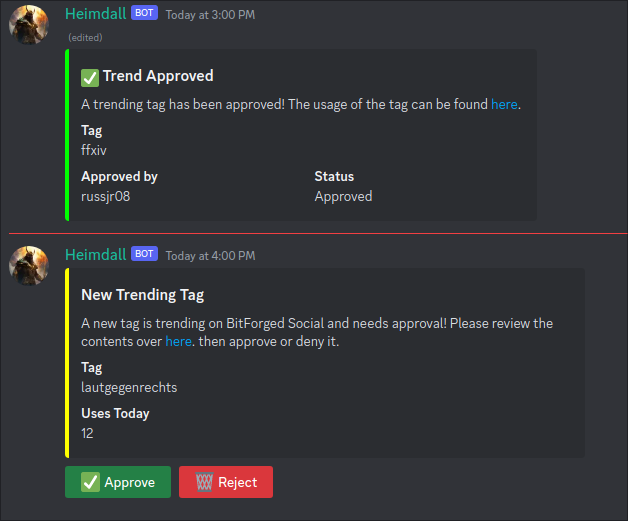

## Mastodon Trends Notifier

Mastodon Trends Notifier is a [Jist](https://git.bitforged.net/system86/jistcord/jistcord) plugin that 
posts the trends of a Mastodon instance to a channel on Discord.

*Currently, it only supports trending hashtags, not links nor user posts—these are planned for later*

Users who have access to the channel can then approve or reject the trend via an embed that is posted to the configured
channel.



### Installation

Since this is a Jist plugin, you need to have Jist installed first. Jist currently is in heavy development, so some basic
instructions on installation will be provided here. If you already have Jist installed, then you can skip to the
"Installing Mastodon Trends Notifier" section.

#### Installing Jist
First, grab a copy of Jist from the [Jist repository](https://git.bitforged.net/system86/jistcord/jistcord). Specifically,
you should head over to the `Pipeline` section, and download the latest artifact from the main branch. 
[This page](https://git.bitforged.net/system86/jistcord/jistcord/-/pipelines?page=1&scope=all&ref=main) will take you to
the Pipelines page for the main branch. 

Each job listed there will have a "stages" section, click the first stage, which
will reveal a dropdown. Click the `create-artifacts` job, and then click the `Browse` button to the right of that page.

This will take you to the artifact page for that job, select the folder `build/libs` folder, and download the `-runtime.jar` file.
It should be the largest file in the folder. The runtime jar contains all necessary dependencies to run Jist.

You'll want to make sure that you have at least Java 17 installed, and create a new folder to place the Jist jar into.

In the folder that you created and placed Jist into, open a Terminal and run the following command:

```bash
java -jar Jist-version-runtime.jar
```

Of course, replace the jar file name with the actual jar file. This will create a few different files and folders, first
open the `conf.json` file and add your Discord Bot token to the `MASTER_TOKEN` field. You can ignore the other options
unless you want debugging enabled, in which case change `debug` to `true`. The superusers field is mostly unused, but it
usually allows the usage of the `/eval` built-in command (which at the time of writing is not functioning). It has no
effect on the plugin itself, however.

Note: For now, your API bot token that you use for Jist needs to have all the privileged intents enabled in the
Discord developer portal.


#### Installing Mastodon Trends Notifier
Now that Jist has been installed, you can drop the plugin into the `plugins` folder. You can find the latest version of
the plugin in the [Pipelines](https://git.bitforged.net/bitforged/mastodon-trends-notifier/-/pipelines) section of the
repository. The latest version will be the first job listed, and you can download the artifact from there.

Afterward, restart Jist, and the plugin should automatically be loaded after Jist downloads the required dependencies.

The plugin will automatically provide you with a link you can use to invite the bot to your server.

### Configuration

The plugin has a few configuration options that you will need to set before it will work. You can find the configuration
file in the `plugins/mastodontrendsnotify` folder, and it will be named `config.json`. The configuration file will be
automatically generated when the plugin is loaded for the first time, and will look like this:

```json
{
  "apiBaseUrl": "https://yourinstance.tld (No trailing slash!)",
  "apiToken": "Generate_From_Mastodon_Development_Area_Grant_Admin_Read_Write",
  "instanceName": "BitForged Social",
  "trendNotificationChannelId": "A Discord Channel ID (Numerical)",
  "cronString": "*/30 * * * *"
}
```

Here is a breakdown of each option:

- `apiBaseUrl`: This should be the base URL of your Mastodon instance, without a trailing slash. For example, if your
 instance is `https://bitforged.social`, then you would put exactly `https://bitforged.social` here.
- `apiToken`: This is the API token that you can generate from the Mastodon development area. You can find this by going
 to your instance, then "Edit Profile" on the left sidebar, and clicking on the "Development" link in the sidebar. This
 is further noted below.
- `instanceName`: This is the name of your instance, and will be used in the embeds that are posted to Discord.
- `trendNotificationChannelId`: This is the ID of the channel that you want the trends to be posted to. You can find
 this by right-clicking on the channel, and clicking "Copy ID." Make sure that you have Developer Mode enabled in your
 Discord settings.
- `cronString`: This is the cron string that will be used to determine how often the trends are checked. You can find
 more information about cron strings [here](https://crontab.guru/). Please make sure this is valid, or the plugin will
 not work properly.

Now that you have configured the plugin, please be sure to take a quick look at the post-configuration section down below.


##### Generating an API Token

Once in the Development area, click on the "New Application" button, and
 fill out the form. You can put whatever you want in the form, but make sure that you select the "admin:read" and "admin:write"
 scopes. Sadly, as far as I can see, there is no specific scope for handling trends. If you're not comfortable with this,
 then you can audit the source code of this plugin (as you should!) to ensure that it is not doing anything malicious. There is no way to
 work around the need for these scopes, however, but if you know of one then please let me know!

Afterward, click the "Submit" button, and you will be taken to a page with your new application. Your token will be shown
next to the "Your access token" field, and copy the token from here. Paste this token into the
 `apiToken` field in the configuration file mentioned above.

#### Post-configuration

Once you have configured the plugin, you can restart Jist, and the plugin should automatically load. Do note that the
plugin has a `/list-trending-tags` command - you should edit the permissions of this command through Discord's server
settings under `Integrations` so that only the users you want to have access to this command can use it. This command
will list the current trending tags, and their "requires approval" status.

Additionally, the same principal applies to the configured trend notification channel. You should only allow users
that you want to be able to approve or reject trends to have access to this channel.

### Usage

Once the plugin is configured, it will automatically post the current trending tags to the channel that you configured,
on the interval that you configured. You'll then be able to approve or reject the trends via the embed that is posted.

### Contact
If you have any questions, concerns, feedback/comments, or just want to say "hello", you can find me on Mastodon at
`@russjr08@bitforged.social` ([direct link](https://bitforged.social/@russjr08)). Additionally, I can be reached on Matrix
at `@russ:bitforged.net` ([direct link](https://matrix.to/#/@russ:bitforged.net)).